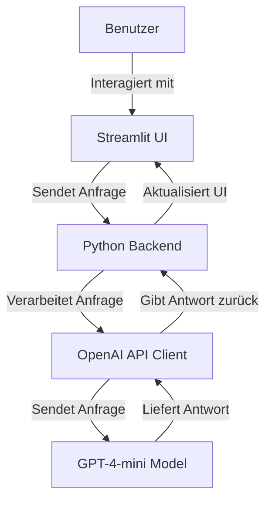

## Anleitung zur Einrichtung 🚀

Dieser Ordner enthält die notwendige Umgebung, um einen Chatbot mit OpenAI in einer Streamlit Dashboard-Anwendung auszuführen.

Bitte beachten, dass in der Umgebung auch geheime API-Schlüssel für ein OpenAI-Konto zur Verfügung gestellt werden. Die App soll daher ausschließlich zu Bildungszwecken im Kurs verwendet und diese Schlüssel nicht mit anderen geteilt werden.



## Assistent "Neo" starten

Um zu testen, ob die Software korrekt eingerichtet ist, nutzen wir zunächst den bereits eingerichteten KI-Assistenten Neo. Neo kennt die Aufgabenstellung in dem Kurs und kann bei der Einrichtung von Streamlit unterstützen:

1. Dieses Repo mit GitHub Desktop klonen und den Ordner **assistant-gpt** in VS Code öffnen.

2. **Anwendung starten**:
   - Windows: Anaconda Command Prompt öffnen und zum Verzeichnis **assistant-gpt** navigieren.
   - Mac: In Visual Studio Code das integrierte Terminal über das VS Code-Menü (Terminal > Neues Terminal) öffnen.
   - In der Befehlszeile eingeben:

     ```bash
     streamlit run app.py
     ```

   - Dieser Befehl sollte den Browser öffnen und zu einer Anmeldeseite weiterleiten.

3. **Anmelden**:
   - Auf der Anmeldeseite:
     - AI Tutor: `CustomGPT`
     - Passwort: `123`

Nun kann mit Neo gechattet werden.

## Eigenen Chatbot erstellen

*Wenn "👋 REPLACE-ME" im Code auftritt, ist dies einfach durch den erforderlichen Inhalt zu ersetzen.*

Um einen eigenen Assistenten zu erstellen, sind die folgenden Schritte in einer Visual Studio Code-Umgebung auszuführen:

In dem Ordner **assistant-gpt** in VS Code:

1. **Assistenten erstellen**:
   - Das Notebook `assistant_create.ipynb` öffnen und den Anweisungen zur Erstellung des Assistenten folgen. 
   - Dieser Schritt muss nur einmal ausgeführt werden. 

2. **Umgebungsvariablen konfigurieren**:
   - Die Datei `assistant.py` öffnen.
   - `👋 REPLACE-ME` durch die zuvor kopierte Assistenten-ID ersetzen:

     ```python
     OPENAI_ASSISTANT='👋 REPLACE-ME'
     ```

   - Nicht vergessen, Neo in Zeile 10 mit `#` zu deaktivieren

     ```python
     # OPENAI_ASSISTANT='asst_1Jmn1tntQOhqHQIvZQCnJhLB'
     ```

   - Die Änderungen speichern und den restlichen Inhalt unverändert lassen.

3. **Die Anwendung starten**:
   - Für Windows: Anaconda Command Prompt öffnen und zum Verzeichnis **assistant-gpt** navigieren.
   - Mac: In Visual Studio Code das integrierte Terminal über das VS Code-Menü (Terminal > Neues Terminal) öffnen.
   - In der Befehlszeile eingeben:

     ```bash
     streamlit run app.py
     ```

   - Dieser Befehl sollte den Browser öffnen und zu einer Anmeldeseite weiterleiten.

4. **Anmelden**:
   - Auf der Anmeldeseite:
     - AI Tutor: `CustomGPT`
     - Passwort: `123`

Nun kann mit dem eigenen Chatbot interagiert werden.

Wie der Chatbot angepasst werden kann wird in dem nächsten Abschnitt erklärt.

## Aktualisierung des Chatbots

Um die Anweisungen für den Chatbot zu aktualisieren:

- Das Notebook `assistant_update.ipynb` öffnen.
- Die angegebenen Schritte befolgen, um die Konfiguration des Chatbots zu ändern und zu aktualisieren.
